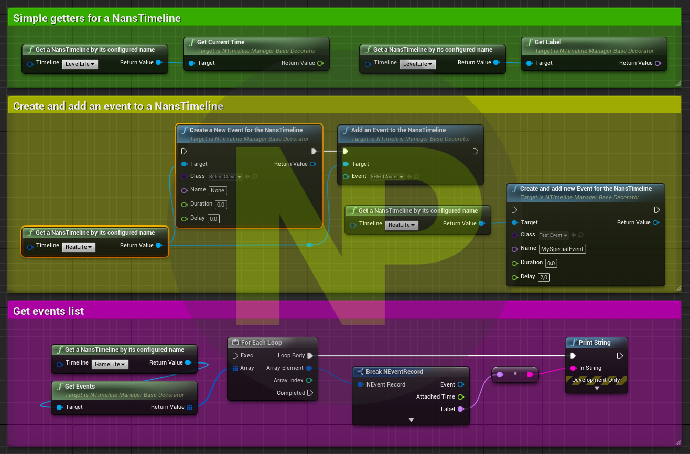
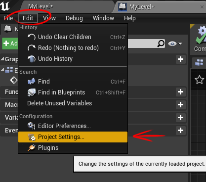
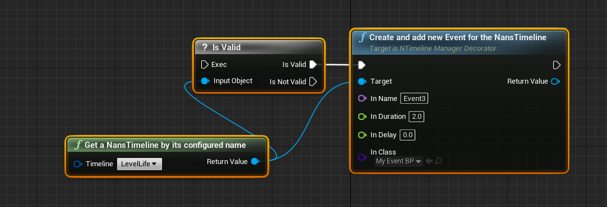
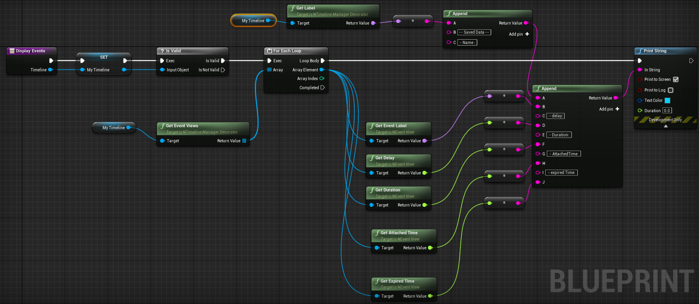

# Nans Timeline system

This plugins allows to keep tracks of time for different timeline paradigm<sup>(1)</sup>, attached events<sup>(2)</sup> to them and managed serialization for Save and Load game.

> 1. [Real life](#331---real-life) time, [Game life](#332---game-life) and [Level life](#333---level-life)
> 2. light `UObject` carrying data and/or simple functionnalities you design



> Note:  
> I've hesitated at first to use the word **"Timeline"** which is already used in the UE4 paradigm for animation (see [this](https://docs.unrealengine.com/en-US/Engine/Blueprints/UserGuide/Timelines/index.html)).  
> The thing is, it's the most accurate word for the feature this plugin provides,
> so I still decided to use it but for BP I prefixed with **Nans** (= **NansTimeline**) everywhere to avoid confusion.

|                                                                                                       <a href="https://www.buymeacoffee.com/NansUE4" target="_blank"></a>                                                                                                        |
| :----------------------------------------------------------------------------------------------------------------------------------------------------------------------------------------------------------------------------------------------------------------------------------------------------------------------------------------------------------------------------------------------: |
| I've decided to make all the code I developped for my games free to use and open source.<br> I am a true believer in the mindset that sharing and collaborating makes the world a better place.<br> The thing is: I'm fulltime dedicated to my project and these open source plugins, for coding I need a looooot of coffee, so please, help me to get my drug :stuck_out_tongue_closed_eyes: !! |

<!-- TOC -->

-   [1. Requirements](#1-requirements)
    -   [1.1. UE4 plugins](#11-ue4-plugins)
-   [2. Usages](#2-usages)
-   [3. Definitions](#3-definitions)
    -   [3.1. Timeline](#31-timeline)
    -   [3.2. Timeline manager](#32-timeline-manager)
    -   [3.3. Timeline manager types](#33-timeline-manager-types)
        -   [3.3.1. - Real Life](#331---real-life)
        -   [3.3.2. - Game Life](#332---game-life)
        -   [3.3.3. - Level Life](#333---level-life)
        -   [3.3.4. - And ...](#334---and-)
    -   [3.4. Event](#34-event)
-   [4. Step by step guide](#4-step-by-step-guide)
    -   [4.1. Installation](#41-installation)
        -   [4.1.1. Clone plugins](#411-clone-plugins)
        -   [4.1.2. Add plugin in your game dependencies](#412-add-plugin-in-your-game-dependencies)
        -   [4.1.3. Use TimelineGameInstance and TimelineClient](#413-use-timelinegameinstance-and-timelineclient)
    -   [4.2. Usages](#42-usages)
        -   [4.2.1. Configure Timelines](#421-configure-timelines)
        -   [4.2.2. Add Event](#422-add-event)
        -   [4.2.3. Get & display](#423-get--display)
-   [5. Contributing and Supporting](#5-contributing-and-supporting)

<!-- /TOC -->

**>> For developers:**

-   [Developers docs](./Docs/Developers.md)

<a id="markdown-1-requirements" name="1-requirements"></a>

## 1. Requirements

<a id="markdown-11-ue4-plugins" name="11-ue4-plugins"></a>

### 1.1. UE4 plugins

-   [NansUE4TestsHelpers](https://github.com/NansPellicari/NansUE4TestsHelpers) (free UE4 plugins)

<a id="markdown-2-usages" name="2-usages"></a>

## 2. Usages

I use this for differents purposes.  
First I created this to manage a **bonus/malus** system cause I needed to centralized their life duration.  
Then I realized that it can be very helpfull for **different purposes** in my game as creating **promotionnal content**, **bonus/malus**, **temporary skills**, **xp earning factors**, ... with a limited time and having **precise stats** for **player activities**.

<a id="markdown-3-definitions" name="3-definitions"></a>

## 3. Definitions

<a id="markdown-31-timeline" name="31-timeline"></a>

### 3.1. Timeline

A timeline is a simple **queue of events** which is dedicated to store (to keep traces for stats) and notify them (depending on their parameters and timeline paradigm) on their lifetime events: start & time increase.  
As a client, you should never have to use it.

<a id="markdown-32-timeline-manager" name="32-timeline-manager"></a>

### 3.2. Timeline manager

Is working as a remote control for **Timeline**, it controls time state (Play, Pause) and stream (tick interval, slow motion, ...).  
As a client, it is your main interface.

<a id="markdown-33-timeline-manager-types" name="33-timeline-manager-types"></a>

### 3.3. Timeline manager types

<a id="markdown-331---real-life" name="331---real-life"></a>

#### 3.3.1. - Real Life

The intent of the **Real Life** timeline is to tracks times **since** the **first start of the game**.  
It is **not affected** by **time alterations** such as **play/pause** and **slow motion**.  
After the game stops, it shoulds **replay** all the **missing time** on game reloading to **update** attached **Events states**.  
As real life is, its state is always **Play**.  
Be careful when you attached events, it could increase memory if they have undeterminate life time.

<a id="markdown-332---game-life" name="332---game-life"></a>

#### 3.3.2. - Game Life

It keeps track of player game session. It follows the same stream, **Play/Pause**, **Stop**, **slow motion**, ...  
After the game stops, it shoulds restart at the exact same time as the last session.  
Be careful too when you attached event here.

<a id="markdown-333---level-life" name="333---level-life"></a>

#### 3.3.3. - Level Life

The same as [Game Life](#2--game-life) but it is reinitialized when level changes.  
You can be less worried on attaching event here, but be aware that all events are definitively removed on reinitialization (level changes).

<a id="markdown-334---and-" name="334---and-"></a>

#### 3.3.4. - And ...

You can easily create your own timeline manager. See [Developers docs](./Docs/Developers.md).

<a id="markdown-34-event" name="34-event"></a>

### 3.4. Event

It is intended to be the most extensible as possible.  
So in its actual state, it is just an abstract class which embeds the necessary data to managed its lifetime.  
You can specialized them with only a simple **Blueprint** or in **c++ classes** (creating a [Decorator](https://refactoring.guru/design-patterns/decorator)) to do what your want.  
To get some examples:

-   I create a **scheduled event** to **trigger a message** to motivate the player when it cumulates an amount of succeeded actions during a determinate range of time.
-   In combination with my [Factors Factory System](https://github.com/NansPellicari/UE4-NansFactorsFactory) and [Interaction System](...), I used them to create temp **Bonus/Malus** after an Actor interaction.
-   ... Sky's the limit!

<a id="markdown-4-step-by-step-guide" name="4-step-by-step-guide"></a>

## 4. Step by step guide

<a id="markdown-41-installation" name="41-installation"></a>

### 4.1. Installation

<a id="markdown-411-clone-plugins" name="411-clone-plugins"></a>

#### 4.1.1. Clone plugins

First, go to your `Plugins` directory and clone project:

```powershell
cd .\Plugins\
git clone git@github.com:NansPellicari/UE4-NansTimelineSystem.git NansTimelineSystem
# /!\ renaming destination folder is important, because UE4 doesn't like dash in project name
# or in your root dir if you already use git for your project
git submodule add git@github.com:NansPellicari/UE4-NansTimelineSystem.git Plugins/NansTimelineSystem
```

You have to clone a dependency too:

```powershell
# still in .\Plugins\ dir
git clone git@github.com:NansPellicari/NansUE4TestsHelpers
# or in your root dir if you already use git for your project
git submodule add git@github.com:NansPellicari/NansUE4TestsHelpers Plugins/NansUE4TestsHelpers
```

<a id="markdown-412-add-plugin-in-your-game-dependencies" name="412-add-plugin-in-your-game-dependencies"></a>

#### 4.1.2. Add plugin in your game dependencies

In your `<MyProject>.uproject` file add these lines:

```json
{
	// other configs here ...
	"Plugins": [
		{
			"Name": "NansTimelineSystem",
			"Enabled": true
		},
		{
			"Name": "NansUE4TestsHelpers",
			"Enabled": true
		}
	]
}
```

in your `Source/<MyProject>.Target.cs` and `Source/<MyProject>Editor.Target.cs`:

```csharp
ExtraModuleNames.AddRange(new string[] {
    // Other dependencies here ...
    "NansTimelineSystemCore",
    "NansTimelineSystemUE4"
});
```

And be sure to have these in your project public dependencies (in `Source/<MyProject>/<MyProject>.Build.cs`):

```csharp
PublicDependencyModuleNames.AddRange(new string[] {
    "Core",
    "CoreUObject",
    "Engine",
    "InputCore",
    "Kismet",
    "NansTimelineSystemCore",
    "NansTimelineSystemUE4",
    "Slate", "SlateCore"
});
```

<a id="markdown-413-use-timelinegameinstance-and-timelineclient" name="413-use-timelinegameinstance-and-timelineclient"></a>

#### 4.1.3. Use TimelineGameInstance and TimelineClient

`UNTimelineGameInstance` is an interface you can use with blueprint or c++:

**> Blueprint**

First create a new Blueprint which inherit from a `UGameInstance` and open blueprint **class settings**:


Add the `NTimelineGameInstance` interface:


Override the `UGameInstance::init()` method + add a new variable of `NTimelineClient` Type:


Override the interface method:


**> c++**

Here an example of a `UGameInstance` class which implements it:

```cpp
// I regroup all in MyGameInstance.h file for simplicity sake.
#pragma once

#include "CoreMinimal.h"
#include "Engine/GameInstance.h"
#include "NansTimelineSystemUE4/Public/Attribute/ConfiguredTimeline.h"
#include "NansTimelineSystemUE4/Public/Manager/TimelineManagerDecorator.h"
#include "NansTimelineSystemUE4/Public/TimelineClient.h"
#include "NansTimelineSystemUE4/Public/TimelineGameInstance.h"

#include "MyGameInstance.generated.h"

UCLASS()
class UE4TIMELINE_API UMyGameInstance : public UGameInstance, public INTimelineGameInstance
{
	GENERATED_BODY()
public:
	UMyGameInstance(){};

	// BEGIN UGameInstance override
	virtual void Init() override
	{
		Super::Init();
		Client = NewObject<UNTimelineClient>(this, FName(TEXT("MyTimelineClient")));
		Client->Init();
	}
	// END UGameInstance override

	// BEGIN INTimelineGameInstance override
	UNTimelineManagerDecorator* GetTimeline_Implementation(FConfiguredTimeline Config) const override
	{
		return Client->GetTimeline(Config);
	}

	virtual UNTimelineClient* GetClient() const override
	{
		return Client;
	}
	// END INTimelineGameInstance override

protected:
	UPROPERTY()
	UNTimelineClient* Client;
};
```

<a id="markdown-42-usages" name="42-usages"></a>

### 4.2. Usages

<a id="markdown-421-configure-timelines" name="421-configure-timelines"></a>

#### 4.2.1. Configure Timelines

Go to your **project** settings:



then to **Nans Timeline** settings:


then **add** new timeline and configure its **name, tick interval and class** for your needs:


<a id="markdown-422-add-event" name="422-add-event"></a>

#### 4.2.2. Add Event

You should use a timeline manager's function



<a id="markdown-423-get--display" name="423-get--display"></a>

#### 4.2.3. Get & display



<a id="markdown-5-contributing-and-supporting" name="5-contributing-and-supporting"></a>

## 5. Contributing and Supporting

I've decided to make all the code I developped for my games free to use and open source.  
I am a true believer in the mindset that sharing and collaborating makes the world a better place.  
I'll be very glad if you decided to help me to follow my dream.

| How?                                                                                                                                                                               |                                                                                         With                                                                                         |
| :--------------------------------------------------------------------------------------------------------------------------------------------------------------------------------- | :----------------------------------------------------------------------------------------------------------------------------------------------------------------------------------: |
| **Donating**<br> Because I'm an independant developper/creator and for now I don't have<br> any income, I need money to support my daily needs (coffeeeeee).                       | <a href="https://www.buymeacoffee.com/NansUE4" target="_blank"></a> |
| **Contributing**<br> You are very welcome if you want to contribute. I explain [here](./CONTRIBUTING.md) in details what<br> is the most comfortable way to me you can contribute. |                                                                         [CONTRIBUTING.md](./CONTRIBUTING.md)                                                                         |
